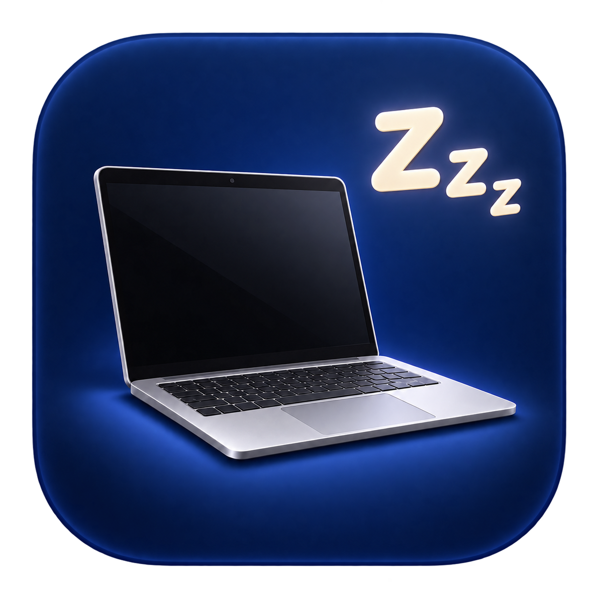
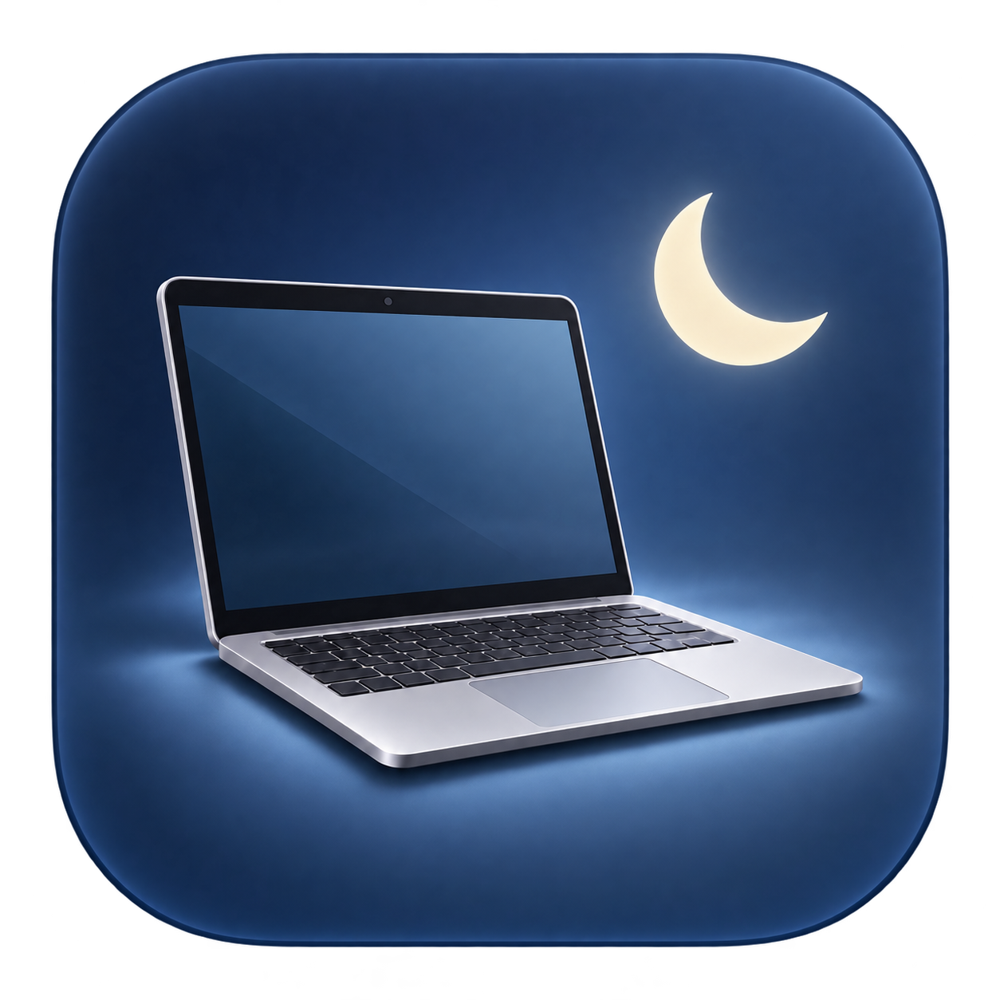
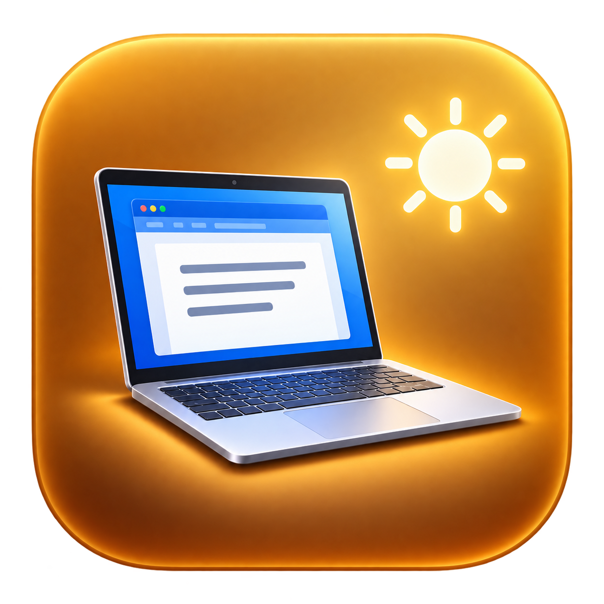

# 电源管理 · HibernateNow

[](https://github.com/ww123cqrt-prog/HibernateNow/actions/workflows/ci.yml)
[](LICENSE)

一个轻量的原生 macOS 电源设置应用。提供三个合盖档位、Dock 右键切换，以及随当前配置变化的 Dock 图标。界面使用中文，采用 SwiftUI 与 AppKit，无第三方运行时依赖。

## 下载与安装

从 [GitHub Releases](https://github.com/ww123cqrt-prog/HibernateNow/releases/latest) 下载 `HibernateNow-<版本>-arm64.dmg`，打开后将“电源管理.app”拖入 Applications，再从“应用程序”启动。

当前提供 Apple Silicon 安装包，最低系统版本声明为 macOS 14.0。Intel 可自行构建，尚未进行 Intel 实机验收。

**当前发布包采用 ad-hoc 签名，没有 Developer ID 签名或 Apple 公证。** 若 macOS 阻止打开，请先核对 Release 的 `SHA256SUMS.txt`；确认来源可信后，按照 [Apple 官方说明](https://support.apple.com/102445) 决定是否允许打开。项目不提供关闭 Gatekeeper 的脚本。

ZIP 是同一个应用的备用下载。Release 还提供 `release-manifest.json`，记录源码提交、逐文件哈希、构建环境与产物哈希。下载全部附件后，可在附件所在目录核对：

```bash
shasum -a 256 -c SHA256SUMS.txt
```

## 三个档位

| 合盖休眠 | 合盖睡眠 | 合盖继续运行 |
| :---: | :---: | :---: |
|  |  |  |
| 请求深度休眠 | 请求普通睡眠 | 阻止系统自动睡眠 |
| `hibernatemode 25` · `disablesleep 0` | `hibernatemode 3` · `disablesleep 0` | `hibernatemode 3` · `disablesleep 1` |

三档设置同时用于电池和接电源。实际睡眠行为取决于 macOS、硬件及外接显示器等条件；模式 25 的具体低功耗效果需要在目标机器上验证。普通睡眠可能暂停程序和网络连接。“合盖继续运行”使用全局禁睡设置，也会阻止空闲自动睡眠，并持续耗电、产生热量。

## 使用

1. 点击“启用免密切换”，在系统授权框输入一次管理员密码。
2. 选择档位并应用，或在应用运行时右键 Dock 图标直接选档。
3. 合盖继续运行需要确认，避免误开禁睡；也可使用“立即睡眠”。

Dock 图标跟随系统读回的完整配置变化。尚未应用的选择不会改变图标；自定义配置或读取失败显示默认图标和问号。打开菜单、返回应用、电脑唤醒及后台每 60 秒都会重新读取配置。

关闭窗口后应用继续运行，真正退出后图标停止更新。电源设置会保留，直到再次修改。图标里的屏幕只是档位示意，不检测屏幕、Word 或实际休眠状态。首次使用休眠档位时，应先在通风桌面验证合盖和唤醒；参数读回一致不能证明背包内的散热安全。

## 免密权限与卸载

应用不保存密码。启用免密会建立 `/private/etc/sudoers.d/cq-hibernatenow-<UID>`，仅允许当前账号以 root 执行以下五条固定命令：

```text
/usr/bin/pmset -a hibernatemode 25 disablesleep 0
/usr/bin/pmset -a hibernatemode 3 disablesleep 0
/usr/bin/pmset -a hibernatemode 3 disablesleep 1
/usr/bin/pmset sleepnow
/usr/bin/pmset -g
```

这是账号级权限，同一账号下的其他程序也能使用这些命令。规则不含通配符或任意 shell 权限；启用和关闭时使用系统管理员授权，并校验 sudoers 语法。日常切换使用 `sudo -n -k`，不依赖缓存密码。

**卸载前**先切回“合盖睡眠”，点击“关闭免密”并完成系统授权，再退出应用并删除它。直接删除应用不会恢复电源设置或删除账号权限。关闭免密本身不会改变当前档位。

如果应用无法打开，可在终端恢复普通睡眠配置：

```bash
sudo /usr/bin/pmset -a hibernatemode 3 disablesleep 0
```

这条命令仅恢复电源配置；移除免密规则应使用应用的“关闭免密”功能。

## 从源码构建

需要 macOS、Xcode Command Line Tools、Swift 5.10 或更新版本和 Python 3。

```bash
git clone https://github.com/ww123cqrt-prog/HibernateNow.git
cd HibernateNow
./script/verify_logic.sh
./script/build_and_run.sh --build
```

应用生成于 `dist/电源管理.app`。`--build` 不会启动或停止已有应用。开发调试可运行 `./script/build_and_run.sh run`；本机安装可使用 `--install`，安装位置为 `~/Applications/电源管理.app`。

生成并核验 DMG、ZIP、构建清单和校验文件：

```bash
./script/package_release.sh
python3 script/verify_release.py
```

检查覆盖解析、严格目标匹配、失败恢复、固定命令授权与规则回滚、Dock 菜单和图标状态。打包检查会只读挂载 DMG，核对原生签名、可执行权限、内容及哈希；不会修改实际电源设置或系统权限。自动检查结果不替代真实合盖测试。

## 项目文档

- [参与开发与发布](CONTRIBUTING.md)
- [安全与漏洞报告](SECURITY.md)
- [更新记录](CHANGELOG.md)
- [图标来源](Resources/README.md)
- [MIT 许可证](LICENSE)
